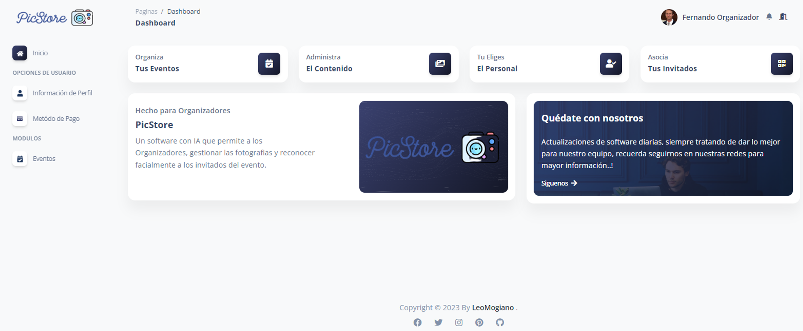
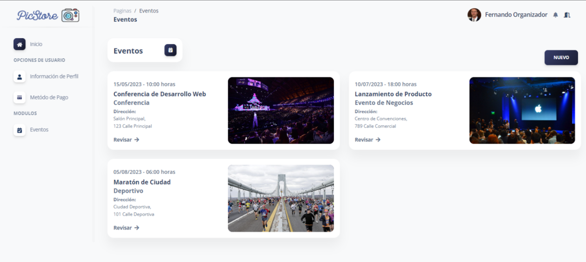

# Plataforma de Gestión de Fotos para Eventos basada en IA
[English](./README.md) | [Español](./README.es.md) | [Français](./README.fr.md) | [日本語](./README.jp.md)


Este es el repositorio para la Plataforma de Gestión de Fotos para Eventos Sociales basada en Inteligencia Artificial (IA). Esta aplicación está desarrollada utilizando el framework Laravel y se centra en la gestión y organización de fotos para eventos como bodas, fiestas, graduaciones, y más, aprovechando la IA para simplificar y mejorar la experiencia del usuario.

## Funciones Clave

- Carga y almacenamiento seguro de fotos.
- Etiquetado y categorización automática de fotos mediante inteligencia artificial.
- Organización de fotos por eventos y álbumes.
- Compartir fotos de forma segura con amigos y familiares.
- Búsqueda avanzada de fotos utilizando etiquetas y metadatos.
- Integración con redes sociales para facilitar el intercambio de fotos.

## Requisitos del Sistema

- PHP 8 o superior
- Composer
- Laravel 8
- MySQL u otro sistema de gestión de bases de datos compatible
- Servidor web - XAMPP

## Instalación

1. Clona este repositorio en tu máquina local:

    ```bash
    git clone https://github.com/LeoMogiano/picstore-web.git
    ```

2. Instala las dependencias del proyecto utilizando Composer:

    ```bash
    composer install
    ```

3. Crea un archivo .env a partir del archivo .env.example:

    ```bash
    cp .env.example .env
    ```

4. Genera una nueva clave de aplicación:

    ```bash
    php artisan key:generate
    ```

5. Configura las variables de entorno en el archivo .env:

    ```bash
    DB_CONNECTION=mysql
    DB_HOST=127.0.0.1
    DB_PORT=3306
    DB_DATABASE=your_database_name
    DB_USERNAME=your_username
    DB_PASSWORD=your_password

    AWS_ACCESS_KEY_ID=
    AWS_SECRET_ACCESS_KEY=
    AWS_DEFAULT_REGION=
    AWS_BUCKET=
    AWS_USE_PATH_STYLE_ENDPOINT=
    ```

6. Ejecuta las migraciones para crear las tablas de la base de datos:

    ```bash
    php artisan migrate
    ```

7. Inicia el servidor de desarrollo:

    ```bash
    php artisan serve
    ```

8. Abre tu navegador y visita http://localhost:8000 para acceder a la plataforma.

## Capturas de Pantalla

Echa un vistazo a algunas capturas de pantalla de la plataforma a continuación.


*Login*



*Dashboard*



*Gestión de Fotógrafos*


*Gestión de Eventos*


*Información del Evento*


*Gestión de Fotos Adquiridas*

