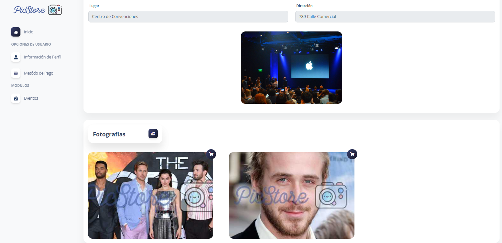
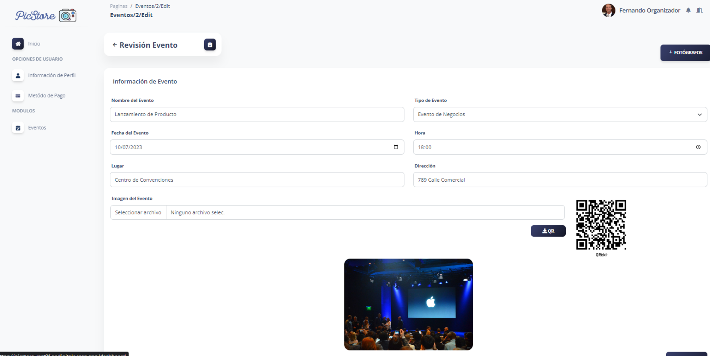
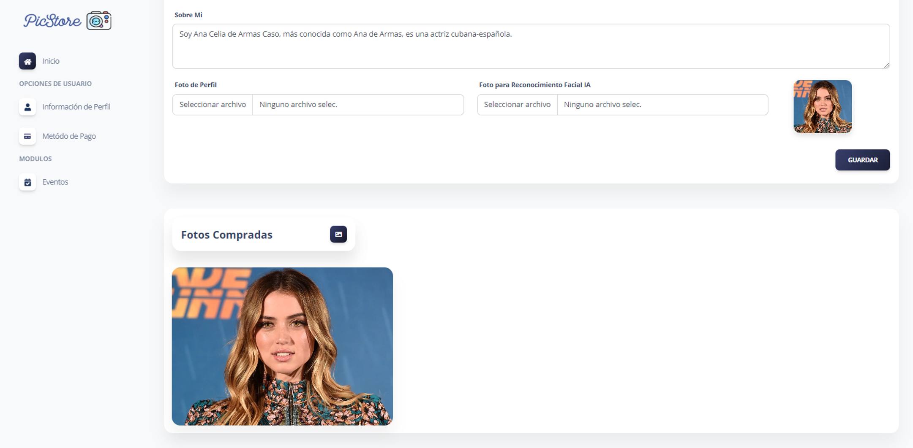

# Plateforme de Gestion de Photos pour Événements Sociaux basée sur l'IA
[English](./README.md) | [Español](./README.es.md) | [Français](./README.fr.md) | [日本語](./README.jp.md)

<p align="center">
  
</p>

Il s'agit du dépôt pour la Plateforme de Gestion de Photos pour Événements Sociaux basée sur l'Intelligence Artificielle (IA). Cette application est développée en utilisant le framework Laravel et se concentre sur la gestion et l'organisation de photos pour des événements tels que des mariages, des fêtes, des remises de diplômes, et plus encore, en tirant parti de l'IA pour simplifier et améliorer l'expérience utilisateur.

## Fonctionnalités Clés

- Chargement et stockage sécurisés des photos.
- Balisage automatique et catégorisation des photos grâce à l'intelligence artificielle.
- Organisation des photos par événements et albums.
- Partage sécurisé des photos avec des amis et la famille.
- Recherche avancée de photos en utilisant des balises et des métadonnées.
- Intégration avec les réseaux sociaux pour faciliter le partage de photos.

## Configuration Système

- PHP 8 ou version ultérieure
- Composer
- Laravel 8
- MySQL ou tout autre système de gestion de base de données compatible
- Serveur web - XAMPP

## Installation

1. Clonez ce dépôt sur votre machine locale :

    ```bash
    git clone https://github.com/LeoMogiano/picstore-web.git
    ```

2. Installez les dépendances du projet avec Composer :

    ```bash
    composer install
    ```

3. Créez un fichier .env à partir du fichier .env.example :

    ```bash
    cp .env.example .env
    ```

4. Générez une nouvelle clé d'application :

    ```bash
    php artisan key:generate
    ```

5. Configurez les variables d'environnement dans le fichier .env :

    ```bash
    DB_CONNECTION=mysql
    DB_HOST=127.0.0.1
    DB_PORT=3306
    DB_DATABASE=your_database_name
    DB_USERNAME=your_username
    DB_PASSWORD=your_password

    AWS_ACCESS_KEY_ID=
    AWS_SECRET_ACCESS_KEY=
    AWS_DEFAULT_REGION=
    AWS_BUCKET=
    AWS_USE_PATH_STYLE_ENDPOINT=
    ```

6. Exécutez les migrations pour créer les tables de la base de données :

    ```bash
    php artisan migrate
    ```

7. Démarrez le serveur de développement :

    ```bash
    php artisan serve
    ```

8. Ouvrez votre navigateur et visitez http://localhost:8000 pour accéder à la plateforme.

## Captures d'écran

Jetez un œil à quelques captures d'écran de la plateforme ci-dessous.


*Login*

<p align="center">
    
</p>

*Dashboard*

<p align="center">
    
</p>

*Gestion des Photographes*

<p align="center">
    
</p>

*Gestion des Événements*

<p align="center">
    
</p>

*Informations sur l'Événement*

<p align="center">
    
</p>

*Gestion des Photos Acquises*

<p align="center">
    
</p>