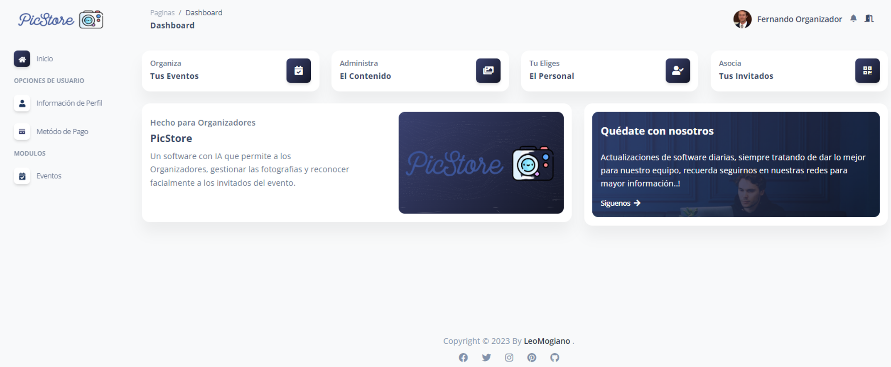
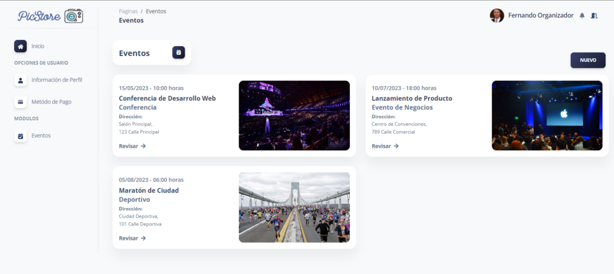
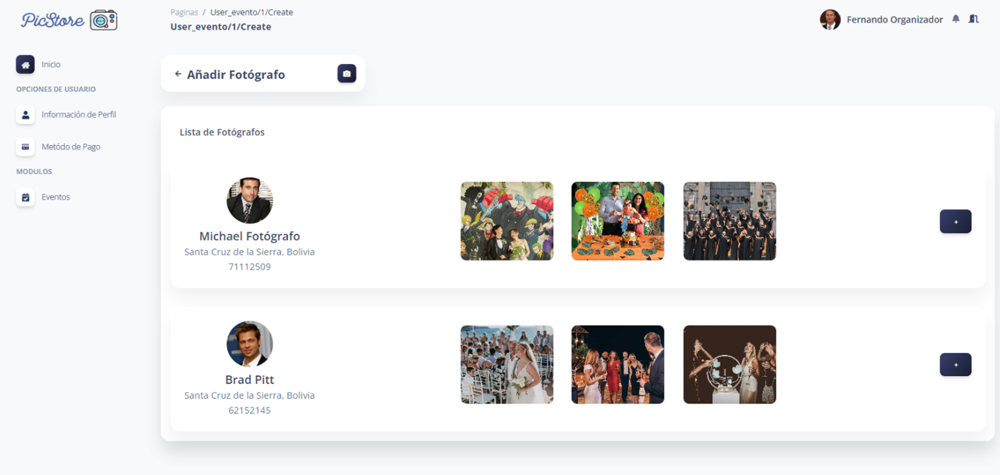
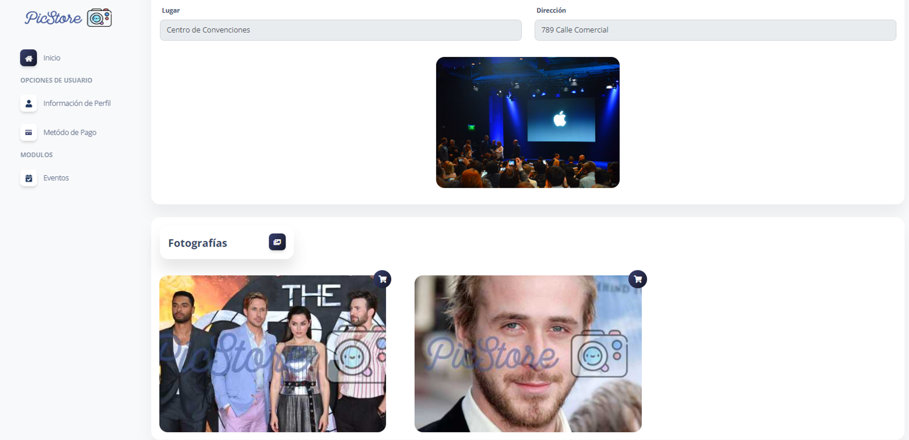
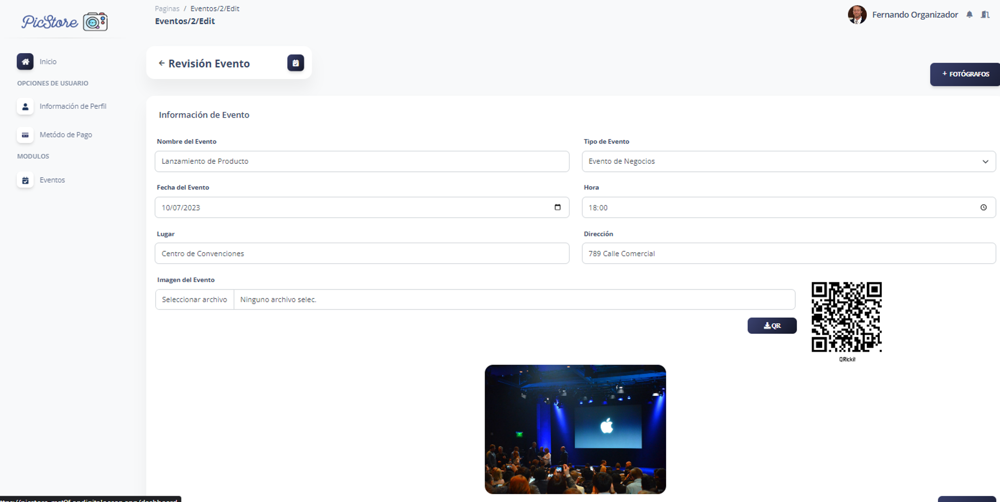
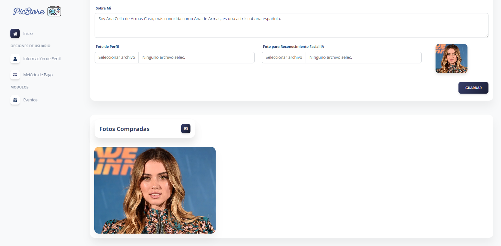

# 写真管理プラットフォーム for ソーシャルイベント
[English](./README.md) | [Español](./README.es.md) | [Français](./README.fr.md) | [日本語](./README.jp.md)


これは、人工知能（AI）を基にしたソーシャルイベントの写真管理プラットフォームのためのリポジトリです。このアプリケーションはLaravelフレームワークを使用して開発され、結婚式、パーティー、卒業式などのイベントの写真の管理と整理に焦点を当てています。ユーザーエクスペリエンスを簡素化し、向上させるためにAIを活用しています。

## 主な機能

- 安全な写真のアップロードと保存。
- AIを使用した自動的な写真のタグ付けとカテゴリ分け。
- イベントとアルバムごとの写真の整理。
- 友達や家族と安全に写真を共有。
- タグやメタデータを使用した高度な写真の検索。
- ソーシャルメディアとの統合による写真の簡単な共有。

## システム要件

- PHP 8 以上
- Composer
- Laravel 8
- MySQL または他の互換性のあるデータベース管理システム
- ウェブサーバー - XAMPP

## インストール 

1. ローカルマシンにこのリポジトリをクローンしてください。

    ```bash
    git clone https://github.com/LeoMogiano/picstore-web.git
    ```

2. Composerを使用してプロジェクトの依存関係をインストールしてください。

    ```bash
    composer install
    ```

3. .env.example ファイルから .env ファイルを作成してください。

    ```bash
    cp .env.example .env
    ```

4. 新しいアプリケーションキーを生成してください。

    ```bash
    php artisan key:generate
    ```

5. .env ファイルで環境変数を構成してください。

    ```bash
    DB_CONNECTION=mysql
    DB_HOST=127.0.0.1
    DB_PORT=3306
    DB_DATABASE=your_database_name
    DB_USERNAME=your_username
    DB_PASSWORD=your_password

    AWS_ACCESS_KEY_ID=
    AWS_SECRET_ACCESS_KEY=
    AWS_DEFAULT_REGION=
    AWS_BUCKET=
    AWS_USE_PATH_STYLE_ENDPOINT=
    ```

6. データベーステーブルを作成するためにマイグレーションを実行してください。

    ```bash
    php artisan migrate
    ```

7. 開発サーバーを起動してください。

    ```bash
    php artisan serve
    ```

8. ブラウザを開いて http://localhost:8000 にアクセスして、プラットフォームにアクセスしてください。

## 画面のキャプチャ

以下に、プラットフォームのいくつかの画面のキャプチャをご覧ください。


*ログイン*



*ダッシュボード*



*写真家の管理*



*イベントの管理*



*イベント情報*



*取得した写真の管理*

