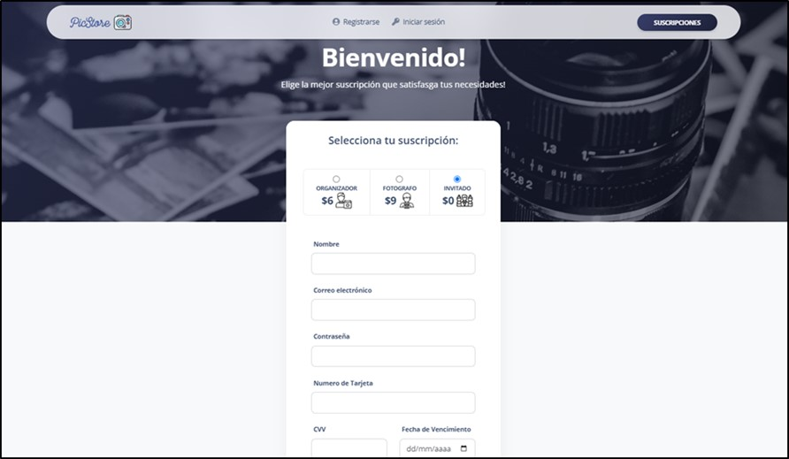

# Plataforma de Gestión de Fotos para Eventos Sociales basadas en la IA

Este es el repositorio de la Plataforma de Gestión de Fotos para Eventos Sociales basadas en la Inteligencia Artificial (IA). Esta aplicación está desarrollada utilizando el framework de Laravel y se enfoca en la gestión y organización de fotos para eventos como bodas, fiestas, graduaciones, y más, aprovechando la IA para simplificar y mejorar la experiencia de los usuarios.

## Funcionalidades Clave

- Subida y almacenamiento seguro de fotos.
- Etiquetado y categorización automática de fotos utilizando IA.
- Organización de fotos por eventos y álbumes.
- Compartir fotos con amigos y familiares de manera segura.
- Búsqueda avanzada de fotos utilizando etiquetas y metadatos.
- Integración con redes sociales para compartir fotos fácilmente.

## Requisitos del Sistema

- PHP 7.4 o superior
- Composer
- Laravel 8
- MySQL o cualquier otro sistema de gestión de bases de datos compatible
- Servidor web (por ejemplo, Apache o Nginx)

## Instalación

1. Clona este repositorio en tu máquina local:

git clone https://github.com/LeoMogiano/picstore-web.git

2. Instala las dependencias del proyecto utilizando Composer:

composer install

3. Crea un archivo .env a partir del archivo .env.example:

cp .env.example .env

4. Genera una nueva clave de aplicación:

php artisan key:generate

5. Configura las variables de entorno en el archivo .env:

DB_CONNECTION=mysql
DB_HOST=127.0.0.1
DB_PORT=3306
DB_DATABASE=nombre_de_tu_base_de_datos
DB_USERNAME=tu_usuario
DB_PASSWORD=tu_contraseña

AWS_ACCESS_KEY_ID=
AWS_SECRET_ACCESS_KEY=
AWS_DEFAULT_REGION=
AWS_BUCKET=
AWS_USE_PATH_STYLE_ENDPOINT=

6. Ejecuta las migraciones para crear las tablas de la base de datos:

php artisan migrate

7. Inicia el servidor de desarrollo:

php artisan serve

9. Abre tu navegador y visita [http://localhost:8000](http://localhost:8000) para acceder a la plataforma.

## Capturas de Pantalla

A continuación, se presentan algunas capturas de pantalla de la Plataforma de Gestión de Fotos:

![Pantalla de Inicio de Sesión]
*Pantalla de inicio de sesión*

*Página principal de la plataforma*
