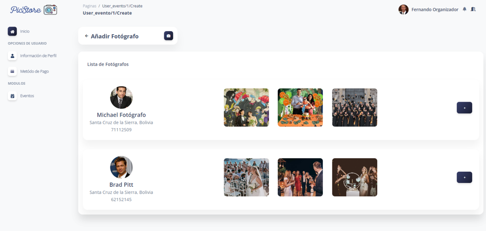

# Photo Management Platform for Social Events based on AI
[English](./README.md) | [Español](./README.es.md) | [Français](./README.fr.md) | [日本語](./README.jp.md)

<p align="center">
  
</p>

This is the repository for the Photo Management Platform for Social Events based on Artificial Intelligence (AI). This application is developed using the Laravel framework and focuses on managing and organizing photos for events such as weddings, parties, graduations, and more, leveraging AI to simplify and enhance the user experience.

## Key Features

-   Secure photo upload and storage.
-   Automatic photo tagging and categorization using AI.
-   Organization of photos by events and albums.
-   Secure photo sharing with friends and family.
-   Advanced photo search using tags and metadata.
-   Integration with social media for easy photo sharing.

## System Requirements

-   PHP 7.4 or higher
-   Composer
-   Laravel 8
-   MySQL or any other compatible database management system
-   Web server (e.g., Apache or Nginx)

## Installation

1. Clone this repository to your local machine:

    ```bash
    git clone https://github.com/LeoMogiano/picstore-web.git
    ```

2. Install project dependencies using Composer:

    ```bash
    composer install
    ```

3. Create a .env file from the .env.example file:

    ```bash
    cp .env.example .env
    ```

4. Generate a new application key:

    ```bash
    php artisan key:generate
    ```

5. Configure the environment variables in the .env file:

    ```bash
    DB_CONNECTION=mysql
    DB_HOST=127.0.0.1
    DB_PORT=3306
    DB_DATABASE=your_database_name
    DB_USERNAME=your_username
    DB_PASSWORD=your_password

    AWS_ACCESS_KEY_ID=
    AWS_SECRET_ACCESS_KEY=
    AWS_DEFAULT_REGION=
    AWS_BUCKET=
    AWS_USE_PATH_STYLE_ENDPOINT=
    ```

6. Run the migrations to create the database tables:

    ```bash
    php artisan migrate
    ```

7. Start the development server:

    ```bash
    php artisan serve
    ```

8. Open your browser and visit http://localhost:8000 to access the platform.

## Screenshots

Check out some screenshots of the platform below.


*Login*


*Dashboard*


*Photographers Management*



*Event Management*


*Event Information*


*Management of Acquired Photos*

